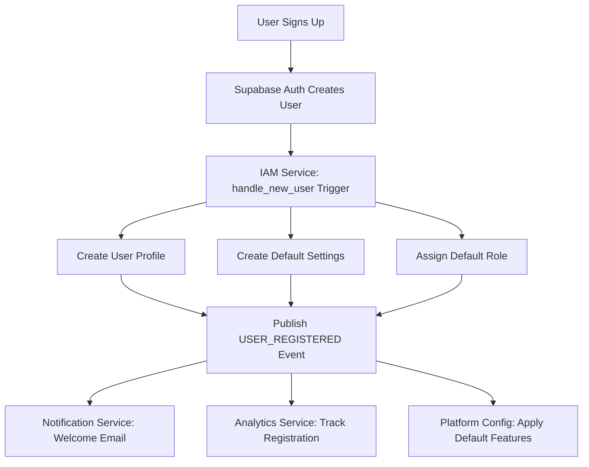
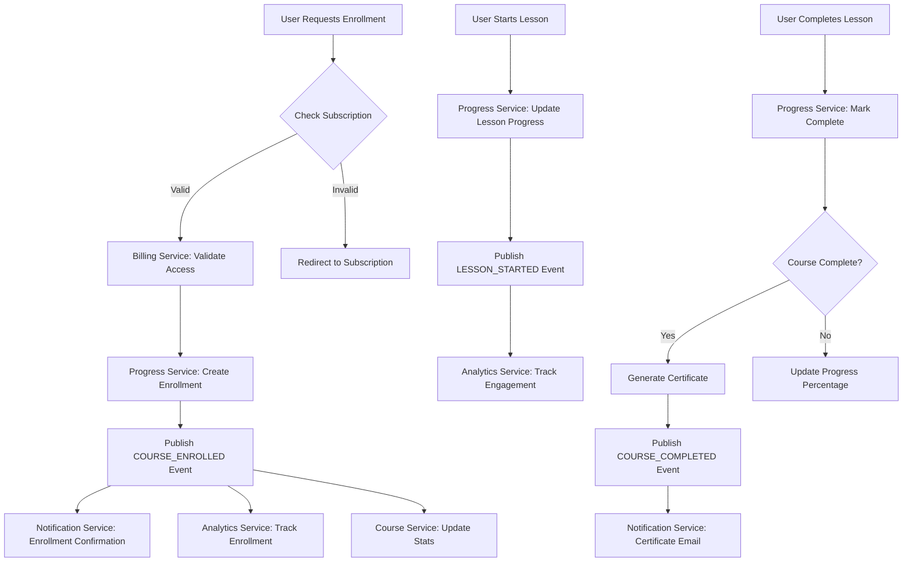
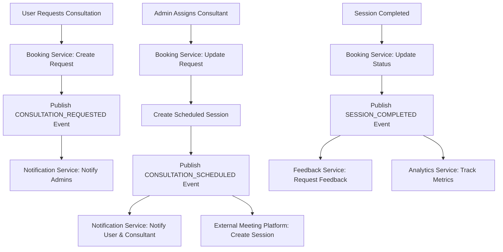
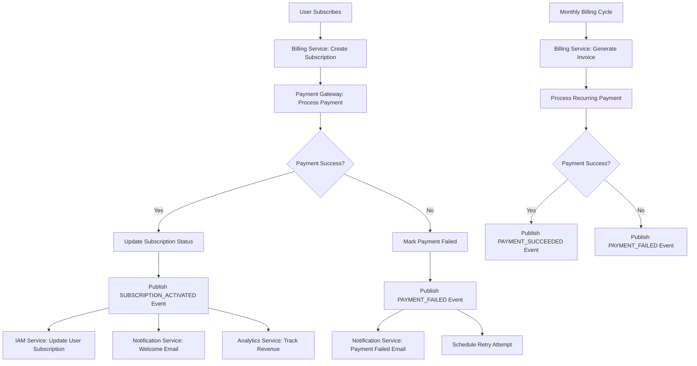
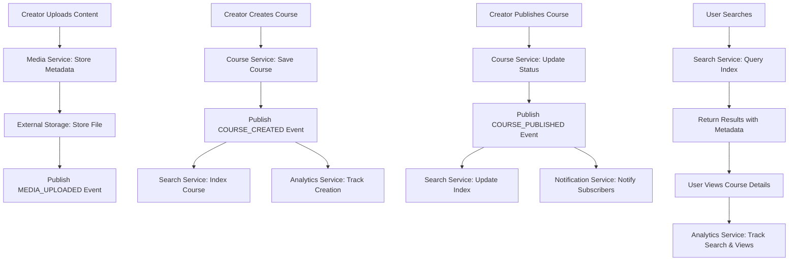

---
title: "LearnExpert Connect: Microservice Database Documentation"
version: "1.0.0"
last_updated: "2025-01-27"
author: "Development Team"
status: "Active"
classification: "Internal"
---


# LearnExpert Connect: Microservice Database Documentation

This document provides the definitive PostgreSQL database schemas for each microservice in the LearnExpert Connect platform.

## Table of Contents

- [Overview](#overview)
- [Architectural Principles](#architectural-principles)
- [Prerequisites](#prerequisites)
- [Service Schemas](#service-schemas)
  - [1. IAM Service (Identity & Access Management)](#1-iam-service-identity--access-management)
  - [2. Course Catalog Service](#2-course-catalog-service)
  - [3. Learner Progress Service](#3-learner-progress-service)
  - [4. Booking & Consultation Service](#4-booking--consultation-service)
  - [5. Billing & Subscription Service](#5-billing--subscription-service)
  - [6. Media Management Service](#61-media-management-service)
  - [7. Feedback Service](#62-feedback-service)
  - [8. Notification Service](#63-notification-service)
  - [9. Platform Configuration Service](#64-platform-configuration-service)
  - [10. Analytics Service](#65-analytics-service)
  - [11. Search Service](#66-search-service)
- [Schema Relationships](#schema-relationships)
- [Data Flow Diagrams](#data-flow-diagrams)
- [Deployment Guidelines](#deployment-guidelines)


## Overview

LearnExpert Connect is a comprehensive learning management platform built on a microservices architecture. This document serves as the definitive reference for all PostgreSQL database schemas across the platform's microservices.

### Purpose
This documentation provides:
- Complete database schema definitions for each microservice
- Architectural guidelines for data management
- Service interaction patterns and data flow
- Setup and deployment instructions

### Scope
This document covers the database schemas for all 11 core microservices that comprise the LearnExpert Connect platform. Each service maintains its own database instance following domain-driven design principles.

### Audience
- Backend developers
- Database administrators
- DevOps engineers
- System architects
- Technical leads

## Prerequisites

### Software Requirements
- PostgreSQL 14.0 or higher
- UUID extension support (`uuid-ossp`)
- Supabase account (for IAM service)
- Kafka cluster (for event streaming)

### Database Setup
Before implementing any schemas, ensure each microservice has:
1. A dedicated PostgreSQL database instance
2. Proper connection pooling configuration
3. Backup and recovery procedures
4. Monitoring and alerting setup

### Security Considerations
- Enable SSL/TLS for all database connections
- Implement proper user roles and permissions
- Configure network security groups
- Enable audit logging

**Architectural Principles:**
*   **Decentralized Data:** Each microservice owns and manages its own database schema. There are no direct foreign key constraints between databases of different services.
*   **Communication:** Services communicate via synchronous REST/gRPC APIs for direct requests and asynchronously via a Kafka message broker for event-driven flows.
*   **Data Integrity:** Integrity is maintained within each service's database using standard PostgreSQL features like foreign keys, constraints, and transactions. Cross-service consistency is eventual and managed at the application layer.

**PostgreSQL Setup Note:**
Before running these schemas, ensure the `uuid-ossp` extension is enabled in your PostgreSQL databases to handle UUID generation:
```sql
CREATE EXTENSION IF NOT EXISTS "uuid-ossp";
```

---

## 1. IAM Service (Identity & Access Management)

*   **Description:** Manages users, roles, permissions, profiles, settings, and basic subscription status. This is the source of truth for user identity and authorization, built directly on Supabase's Auth and database features.
*   **Hosting:** This schema is run within a **Supabase project's PostgreSQL database**. It extends Supabase's `auth.users` table with custom tables in the `public` schema and leverages PostgreSQL Functions, Triggers, and Row Level Security (RLS) for automation and security.

```sql
-- ========= IAM Service Schema (for Supabase PostgreSQL) =========

-- ### User Profile & Settings Tables ###
-- Extends the default auth.users table provided by Supabase Auth
CREATE TABLE IF NOT EXISTS public.user_profiles (
    id UUID REFERENCES auth.users(id) ON DELETE CASCADE PRIMARY KEY,
    username TEXT UNIQUE,
    full_name TEXT,
    avatar_url TEXT,
    bio TEXT,
    website TEXT,
    email TEXT UNIQUE NOT NULL,
    role TEXT NOT NULL DEFAULT 'user', -- Note: This is a denormalized role name, the source of truth is user_roles
    is_verified BOOLEAN DEFAULT FALSE,
    created_at TIMESTAMP WITH TIME ZONE DEFAULT CURRENT_TIMESTAMP,
    updated_at TIMESTAMP WITH TIME ZONE DEFAULT CURRENT_TIMESTAMP
);

-- User-specific preferences
CREATE TABLE IF NOT EXISTS public.user_settings (
    id UUID REFERENCES auth.users(id) ON DELETE CASCADE PRIMARY KEY,
    email_notifications BOOLEAN DEFAULT TRUE,
    marketing_emails BOOLEAN DEFAULT TRUE,
    theme TEXT DEFAULT 'system', -- e.g., 'light', 'dark', 'system'
    language TEXT DEFAULT 'en',
    created_at TIMESTAMP WITH TIME ZONE DEFAULT CURRENT_TIMESTAMP,
    updated_at TIMESTAMP WITH TIME ZONE DEFAULT CURRENT_TIMESTAMP
);

-- ### Basic Subscription & Session Tracking (within IAM context) ###
-- Note: The full subscription logic resides in the dedicated Billing Service. This table may hold basic status for RLS purposes.
CREATE TABLE IF NOT EXISTS public.user_subscriptions (
    id UUID DEFAULT uuid_generate_v4() PRIMARY KEY,
    user_id UUID REFERENCES auth.users(id) ON DELETE CASCADE NOT NULL,
    plan_id TEXT NOT NULL,
    status TEXT NOT NULL, -- e.g., 'active', 'trialing', 'past_due'
    current_period_start TIMESTAMP WITH TIME ZONE,
    current_period_end TIMESTAMP WITH TIME ZONE,
    cancel_at_period_end BOOLEAN DEFAULT FALSE,
    created_at TIMESTAMP WITH TIME ZONE DEFAULT CURRENT_TIMESTAMP,
    updated_at TIMESTAMP WITH TIME ZONE DEFAULT CURRENT_TIMESTAMP
);

-- Optional: For tracking active user sessions if needed
CREATE TABLE IF NOT EXISTS public.user_sessions (
    id UUID DEFAULT uuid_generate_v4() PRIMARY KEY,
    user_id UUID REFERENCES auth.users(id) ON DELETE CASCADE NOT NULL,
    device TEXT,
    ip_address TEXT,
    user_agent TEXT,
    last_active TIMESTAMP WITH TIME ZONE DEFAULT CURRENT_TIMESTAMP,
    created_at TIMESTAMP WITH TIME ZONE DEFAULT CURRENT_TIMESTAMP
);

-- Note: Password reset tokens are handled internally by Supabase Auth `auth.identities` and are not typically managed in a public table.
-- The provided `password_reset_tokens` table is a custom implementation if you choose to override Supabase's flow.

-- ### Roles and Permissions System ###
CREATE TABLE IF NOT EXISTS public.roles (
    id SERIAL PRIMARY KEY,
    name TEXT UNIQUE NOT NULL, -- e.g., 'user', 'admin', 'creator', 'consultant'
    description TEXT,
    created_at TIMESTAMP WITH TIME ZONE DEFAULT CURRENT_TIMESTAMP
);

CREATE TABLE IF NOT EXISTS public.permissions (
    id SERIAL PRIMARY KEY,
    name TEXT UNIQUE NOT NULL, -- e.g., 'read:courses', 'update:own_profile'
    description TEXT,
    created_at TIMESTAMP WITH TIME ZONE DEFAULT CURRENT_TIMESTAMP
);

-- Junction table to assign permissions to roles
CREATE TABLE IF NOT EXISTS public.role_permissions (
    role_id INTEGER REFERENCES public.roles(id) ON DELETE CASCADE,
    permission_id INTEGER REFERENCES public.permissions(id) ON DELETE CASCADE,
    created_at TIMESTAMP WITH TIME ZONE DEFAULT CURRENT_TIMESTAMP,
    PRIMARY KEY (role_id, permission_id)
);

-- Junction table to assign roles to users
CREATE TABLE IF NOT EXISTS public.user_roles (
    user_id UUID REFERENCES auth.users(id) ON DELETE CASCADE,
    role_id INTEGER REFERENCES public.roles(id) ON DELETE CASCADE,
    created_at TIMESTAMP WITH TIME ZONE DEFAULT CURRENT_TIMESTAMP,
    PRIMARY KEY (user_id, role_id)
);

-- ### Automation: Functions and Triggers ###

-- Function to automatically update the 'updated_at' timestamp on table updates
CREATE OR REPLACE FUNCTION public.update_updated_at_column()
RETURNS TRIGGER AS $$
BEGIN
    NEW.updated_at = CURRENT_TIMESTAMP;
    RETURN NEW;
END;
$$ LANGUAGE plpgsql;

-- Trigger to apply the update function to relevant tables
CREATE TRIGGER update_user_profiles_updated_at BEFORE UPDATE ON public.user_profiles FOR EACH ROW EXECUTE FUNCTION public.update_updated_at_column();
CREATE TRIGGER update_user_settings_updated_at BEFORE UPDATE ON public.user_settings FOR EACH ROW EXECUTE FUNCTION public.update_updated_at_column();
CREATE TRIGGER update_user_subscriptions_updated_at BEFORE UPDATE ON public.user_subscriptions FOR EACH ROW EXECUTE FUNCTION public.update_updated_at_column();


-- Function to populate associated tables upon new user creation in auth.users
CREATE OR REPLACE FUNCTION public.handle_new_user()
RETURNS TRIGGER AS $$
BEGIN
    -- Create user profile using metadata from sign-up
    INSERT INTO public.user_profiles (id, email, username, full_name)
    VALUES (NEW.id, NEW.email, NEW.raw_user_meta_data->>'username', NEW.raw_user_meta_data->>'full_name');
    
    -- Create default user settings
    INSERT INTO public.user_settings (id)
    VALUES (NEW.id);
    
    -- Assign the default 'user' role
    INSERT INTO public.user_roles (user_id, role_id)
    SELECT NEW.id, r.id FROM public.roles r WHERE r.name = 'user';
    
    RETURN NEW;
END;
$$ LANGUAGE plpgsql;

-- Trigger that calls the function after a new user signs up
CREATE TRIGGER on_auth_user_created
AFTER INSERT ON auth.users
FOR EACH ROW
EXECUTE FUNCTION public.handle_new_user();


-- ### Security: Row Level Security (RLS) Policies ###

-- Enable RLS on tables containing user-specific data
ALTER TABLE public.user_profiles ENABLE ROW LEVEL SECURITY;
ALTER TABLE public.user_settings ENABLE ROW LEVEL SECURITY;
ALTER TABLE public.user_subscriptions ENABLE ROW LEVEL SECURITY;
-- ... and others as needed

-- Example RLS Policies:
-- Allow users to view and update their own profile
CREATE POLICY "Users can view their own profile" ON public.user_profiles FOR SELECT USING (auth.uid() = id);
CREATE POLICY "Users can update their own profile" ON public.user_profiles FOR UPDATE USING (auth.uid() = id);

-- Allow admins to perform any action on profiles
CREATE POLICY "Admins have full access to profiles" ON public.user_profiles FOR ALL USING (
  EXISTS (
    SELECT 1 FROM public.user_roles ur
    JOIN public.roles r ON ur.role_id = r.id
    WHERE ur.user_id = auth.uid() AND r.name = 'admin'
  )
);

-- Policies for other tables (user_settings, user_subscriptions) would follow a similar pattern,
-- allowing users to access their own data and admins to access all data.

---

## 2. Course Catalog Service

*   **Description:** The source of truth for all course content structure. Manages courses, versions, modules, lessons, quizzes, categories, tags, and their translations.
*   **Hosting:** Native PostgreSQL.

```sql
-- ========= Course Catalog Service Schema =========

-- ### ENUM Types for Course Service ###
CREATE TYPE publication_status AS ENUM ('draft', 'pending_review', 'published', 'archived');
CREATE TYPE lesson_type AS ENUM ('video', 'text_image', 'quiz_ref');
CREATE TYPE question_type AS ENUM ('single_choice', 'multiple_choice', 'true_false', 'short_answer');

-- ### Core Course Structure ###
CREATE TABLE courses (
    id UUID PRIMARY KEY DEFAULT uuid_generate_v4(),
    primary_author_user_id UUID NOT NULL, -- User ID from IAM service
    created_at TIMESTAMPTZ NOT NULL DEFAULT NOW(),
    updated_at TIMESTAMPTZ,
    is_deleted BOOLEAN NOT NULL DEFAULT FALSE,
    deleted_at TIMESTAMPTZ
);

CREATE TABLE course_versions (
    id UUID PRIMARY KEY DEFAULT uuid_generate_v4(),
    course_id UUID NOT NULL REFERENCES courses(id) ON DELETE CASCADE,
    version_number INT NOT NULL DEFAULT 1,
    publication_status publication_status NOT NULL DEFAULT 'draft',
    published_at TIMESTAMPTZ,
    changelog TEXT,
    min_quiz_score_for_cert REAL CHECK (min_quiz_score_for_cert >= 0 AND min_quiz_score_for_cert <= 100),
    created_at TIMESTAMPTZ NOT NULL DEFAULT NOW(),
    updated_at TIMESTAMPTZ,
    UNIQUE (course_id, version_number)
);

CREATE TABLE modules (
    id UUID PRIMARY KEY DEFAULT uuid_generate_v4(),
    course_version_id UUID NOT NULL REFERENCES course_versions(id) ON DELETE CASCADE,
    display_order INT NOT NULL DEFAULT 0,
    created_at TIMESTAMPTZ NOT NULL DEFAULT NOW(),
    updated_at TIMESTAMPTZ
);

CREATE TABLE lessons (
    id UUID PRIMARY KEY DEFAULT uuid_generate_v4(),
    module_id UUID NOT NULL REFERENCES modules(id) ON DELETE CASCADE,
    lesson_type lesson_type NOT NULL DEFAULT 'video',
    display_order INT NOT NULL DEFAULT 0,
    estimated_duration_minutes INT,
    created_at TIMESTAMPTZ NOT NULL DEFAULT NOW(),
    updated_at TIMESTAMPTZ
);

-- ### Quizzes and Questions Structure ###
CREATE TABLE quizzes (
    id UUID PRIMARY KEY DEFAULT uuid_generate_v4(),
    associated_lesson_id UUID UNIQUE REFERENCES lessons(id) ON DELETE SET NULL,
    pass_threshold_percentage REAL CHECK (pass_threshold_percentage >= 0 AND pass_threshold_percentage <= 100),
    time_limit_minutes INT,
    max_attempts INT,
    created_at TIMESTAMPTZ NOT NULL DEFAULT NOW(),
    updated_at TIMESTAMPTZ
);

CREATE TABLE questions (
    id UUID PRIMARY KEY DEFAULT uuid_generate_v4(),
    quiz_id UUID NOT NULL REFERENCES quizzes(id) ON DELETE CASCADE,
    question_type question_type NOT NULL,
    display_order INT NOT NULL DEFAULT 0,
    points INT NOT NULL DEFAULT 1,
    created_at TIMESTAMPTZ NOT NULL DEFAULT NOW(),
    updated_at TIMESTAMPTZ
);

CREATE TABLE answers (
    id UUID PRIMARY KEY DEFAULT uuid_generate_v4(),
    question_id UUID NOT NULL REFERENCES questions(id) ON DELETE CASCADE,
    is_correct BOOLEAN NOT NULL,
    display_order INT NOT NULL DEFAULT 0,
    feedback_if_selected TEXT,
    created_at TIMESTAMPTZ NOT NULL DEFAULT NOW(),
    updated_at TIMESTAMPTZ
);

-- ### Translation Tables ###
CREATE TABLE course_version_translations (
    course_version_id UUID NOT NULL REFERENCES course_versions(id) ON DELETE CASCADE,
    language_code VARCHAR(10) NOT NULL,
    title VARCHAR(255) NOT NULL,
    description TEXT,
    learning_objectives TEXT,
    PRIMARY KEY (course_version_id, language_code)
);

CREATE TABLE module_translations (
    module_id UUID NOT NULL REFERENCES modules(id) ON DELETE CASCADE,
    language_code VARCHAR(10) NOT NULL,
    title VARCHAR(255) NOT NULL,
    description TEXT,
    PRIMARY KEY (module_id, language_code)
);

CREATE TABLE lesson_translations (
    lesson_id UUID NOT NULL REFERENCES lessons(id) ON DELETE CASCADE,
    language_code VARCHAR(10) NOT NULL,
    title VARCHAR(255) NOT NULL,
    content_text TEXT,
    PRIMARY KEY (lesson_id, language_code)
);

CREATE TABLE quiz_translations (
    quiz_id UUID NOT NULL REFERENCES quizzes(id) ON DELETE CASCADE,
    language_code VARCHAR(10) NOT NULL,
    title VARCHAR(255) NOT NULL,
    description TEXT,
    PRIMARY KEY (quiz_id, language_code)
);

CREATE TABLE question_translations (
    question_id UUID NOT NULL REFERENCES questions(id) ON DELETE CASCADE,
    language_code VARCHAR(10) NOT NULL,
    question_text TEXT NOT NULL,
    hint TEXT,
    PRIMARY KEY (question_id, language_code)
);

CREATE TABLE answer_translations (
    answer_id UUID NOT NULL REFERENCES answers(id) ON DELETE CASCADE,
    language_code VARCHAR(10) NOT NULL,
    answer_text TEXT NOT NULL,
    PRIMARY KEY (answer_id, language_code)
);

-- ### Content Organization ###
CREATE TABLE categories (
    id UUID PRIMARY KEY DEFAULT uuid_generate_v4(),
    parent_category_id UUID REFERENCES categories(id) ON DELETE SET NULL,
    is_active BOOLEAN NOT NULL DEFAULT TRUE,
    created_at TIMESTAMPTZ NOT NULL DEFAULT NOW()
);

CREATE TABLE category_translations (
    category_id UUID NOT NULL REFERENCES categories(id) ON DELETE CASCADE,
    language_code VARCHAR(10) NOT NULL,
    name VARCHAR(255) NOT NULL,
    PRIMARY KEY (category_id, language_code)
);

CREATE TABLE course_categories (
    course_id UUID NOT NULL REFERENCES courses(id) ON DELETE CASCADE,
    category_id UUID NOT NULL REFERENCES categories(id) ON DELETE CASCADE,
    PRIMARY KEY (course_id, category_id)
);

-- Tags can be managed similarly if needed
```

---

## 3. Learner Progress Service

*   **Description:** Tracks all user interactions related to learning progress, including enrollments, lesson completions, quiz attempts, and generated certificates.
*   **Hosting:** Native PostgreSQL.

```sql
-- ========= Learner Progress Service Schema =========

-- ### ENUM Types for Learner Progress Service ###
CREATE TYPE enrollment_status AS ENUM ('active', 'completed', 'cancelled_by_user', 'revoked_by_admin');
CREATE TYPE progress_status AS ENUM ('not_started', 'in_progress', 'completed');

-- ### Core Progress Tracking Tables ###
CREATE TABLE enrollments (
    user_id UUID NOT NULL, -- User ID from IAM service
    course_version_id UUID NOT NULL, -- Course Version ID from Course service
    enrolled_at TIMESTAMPTZ NOT NULL DEFAULT NOW(),
    status enrollment_status NOT NULL DEFAULT 'active',
    completed_at TIMESTAMPTZ,
    PRIMARY KEY (user_id, course_version_id)
);

CREATE TABLE lesson_progress (
    user_id UUID NOT NULL,
    lesson_id UUID NOT NULL, -- Lesson ID from Course service
    enrolled_course_version_id UUID NOT NULL, -- Context from enrollments table
    status progress_status NOT NULL DEFAULT 'not_started',
    progress_percentage REAL DEFAULT 0 CHECK (progress_percentage >= 0 AND progress_percentage <= 100),
    last_accessed_at TIMESTAMPTZ NOT NULL DEFAULT NOW(),
    started_at TIMESTAMPTZ,
    completed_at TIMESTAMPTZ,
    PRIMARY KEY (user_id, lesson_id, enrolled_course_version_id)
    -- A foreign key to enrollments(user_id, course_version_id) could be added
    -- but is often managed at application level in microservices.
);

CREATE TABLE quiz_attempts (
    id UUID PRIMARY KEY DEFAULT uuid_generate_v4(),
    user_id UUID NOT NULL,
    quiz_id UUID NOT NULL, -- Quiz ID from Course service
    enrolled_course_version_id UUID NOT NULL, -- Context from enrollments table
    attempt_number INT NOT NULL DEFAULT 1,
    score REAL CHECK (score >= 0 AND score <= 100),
    is_passed BOOLEAN,
    started_at TIMESTAMPTZ NOT NULL DEFAULT NOW(),
    completed_at TIMESTAMPTZ,
    answers_snapshot JSONB,
    UNIQUE (user_id, quiz_id, enrolled_course_version_id, attempt_number)
);

-- ### Certification ###
CREATE TABLE certificates (
    id UUID PRIMARY KEY DEFAULT uuid_generate_v4(),
    user_id UUID NOT NULL,
    course_version_id UUID NOT NULL,
    issued_at TIMESTAMPTZ NOT NULL DEFAULT NOW(),
    certificate_uid VARCHAR(255) UNIQUE NOT NULL,
    metadata JSONB, -- Snapshot of course title, user name etc.
    UNIQUE (user_id, course_version_id)
);
```

---

## 4. Booking & Consultation Service

*   **Description:** Manages the entire lifecycle of consultation requests, from consultant availability and user requests to final scheduling and integration with the Meeting Platform.
*   **Hosting:** Native PostgreSQL.

```sql
-- ========= Booking & Consultation Service Schema =========

-- ### ENUM Types for Booking Service ###
CREATE TYPE consultation_status AS ENUM ('pending_assignment', 'pending_confirmation', 'scheduled', 'cancelled', 'completed', 'rejected');
CREATE TYPE scheduled_session_status AS ENUM ('scheduled', 'in_progress', 'completed', 'cancelled_by_user', 'cancelled_by_consultant', 'no_show_user', 'no_show_consultant');

-- ### Service & Profile Setup ###
CREATE TABLE consultation_service_types (
    id UUID PRIMARY KEY DEFAULT uuid_generate_v4(),
    name VARCHAR(255) NOT NULL,
    description TEXT,
    default_duration_minutes INT NOT NULL,
    is_active BOOLEAN NOT NULL DEFAULT TRUE,
    created_at TIMESTAMPTZ NOT NULL DEFAULT NOW(),
    updated_at TIMESTAMPTZ
);

CREATE TABLE consultant_profiles (
    consultant_user_id UUID PRIMARY KEY, -- User ID from IAM service
    bio TEXT,
    specializations TEXT[],
    is_available_for_booking BOOLEAN NOT NULL DEFAULT TRUE,
    created_at TIMESTAMPTZ NOT NULL DEFAULT NOW(),
    updated_at TIMESTAMPTZ
);

CREATE TABLE consultant_availability_slots (
    id UUID PRIMARY KEY DEFAULT uuid_generate_v4(),
    consultant_user_id UUID NOT NULL REFERENCES consultant_profiles(consultant_user_id) ON DELETE CASCADE,
    start_time TIMESTAMPTZ NOT NULL,
    end_time TIMESTAMPTZ NOT NULL,
    is_booked BOOLEAN NOT NULL DEFAULT FALSE
);

-- ### Booking Lifecycle ###
CREATE TABLE consultation_requests (
    id UUID PRIMARY KEY DEFAULT uuid_generate_v4(),
    requester_user_id UUID NOT NULL, -- User ID from IAM service
    consultation_service_type_id UUID NOT NULL REFERENCES consultation_service_types(id),
    request_details TEXT,
    status consultation_status NOT NULL DEFAULT 'pending_assignment',
    requested_at TIMESTAMTz NOT NULL DEFAULT NOW(),
    updated_at TIMESTAMPTZ
);

CREATE TABLE scheduled_sessions (
    id UUID PRIMARY KEY DEFAULT uuid_generate_v4(),
    consultation_request_id UUID UNIQUE NOT NULL REFERENCES consultation_requests(id),
    requester_user_id UUID NOT NULL,
    consultant_user_id UUID NOT NULL REFERENCES consultant_profiles(consultant_user_id),
    scheduled_start_time TIMESTAMPTZ NOT NULL,
    scheduled_end_time TIMESTAMPTZ NOT NULL,
    meeting_platform_session_id VARCHAR(255),
    meeting_platform_join_url TEXT,
    status scheduled_session_status NOT NULL DEFAULT 'scheduled',
    created_at TIMESTAMPTZ NOT NULL DEFAULT NOW(),
    updated_at TIMESTAMPTZ
);
```

---

## 5. Billing & Subscription Service

*   **Description:** Manages all financial aspects of the platform, including subscription plans, customer subscriptions, payments, and invoicing. Integrates tightly with an external payment gateway.
*   **Hosting:** Native PostgreSQL.

```sql
-- ========= Billing & Subscription Service Schema =========

-- ### ENUM Types for Billing Service ###
CREATE TYPE plan_type AS ENUM ('solo_learner', 'enterprise');
CREATE TYPE subscription_status AS ENUM ('trialing', 'active', 'past_due', 'cancelled', 'expired', 'payment_failed');
CREATE TYPE payment_status AS ENUM ('pending', 'succeeded', 'failed', 'refunded', 'disputed');
CREATE TYPE invoice_status AS ENUM ('draft', 'open', 'paid', 'void', 'uncollectible');
CREATE TYPE discount_type AS ENUM ('percentage', 'fixed_amount');

-- ### Plans and Subscriptions ###
CREATE TABLE subscription_plans (
    id UUID PRIMARY KEY DEFAULT uuid_generate_v4(),
    name VARCHAR(255) UNIQUE NOT NULL,
    plan_type plan_type NOT NULL,
    price_monthly DECIMAL(10,2),
    price_yearly DECIMAL(10,2),
    price_per_user_monthly DECIMAL(10,2), -- For enterprise plans
    currency_code VARCHAR(3) NOT NULL DEFAULT 'USD',
    is_active BOOLEAN NOT NULL DEFAULT TRUE,
    trial_period_days INT NOT NULL DEFAULT 0
);

CREATE TABLE user_subscriptions (
    id UUID PRIMARY KEY DEFAULT uuid_generate_v4(),
    user_id UUID, -- For solo learners, from IAM
    company_id UUID, -- For enterprises, from IAM
    subscription_plan_id UUID NOT NULL REFERENCES subscription_plans(id),
    status subscription_status NOT NULL DEFAULT 'trialing',
    current_period_start DATE NOT NULL,
    current_period_end DATE NOT NULL,
    quantity INT NOT NULL DEFAULT 1, -- For enterprise seat count
    payment_gateway_customer_id VARCHAR(255),
    payment_gateway_subscription_id VARCHAR(255) UNIQUE,
    created_at TIMESTAMPTZ NOT NULL DEFAULT NOW(),
    cancelled_at TIMESTAMPTZ,
    CHECK ((user_id IS NOT NULL AND company_id IS NULL) OR (user_id IS NULL AND company_id IS NOT NULL))
);

-- ### Financial Records ###
CREATE TABLE payments (
    id UUID PRIMARY KEY DEFAULT uuid_generate_v4(),
    user_subscription_id UUID REFERENCES user_subscriptions(id),
    amount_decimal DECIMAL(10,2) NOT NULL,
    currency_code VARCHAR(3) NOT NULL,
    status payment_status NOT NULL,
    payment_gateway_charge_id VARCHAR(255) UNIQUE NOT NULL,
    paid_at TIMESTAMPTZ,
    created_at TIMESTAMPTZ NOT NULL DEFAULT NOW()
);

CREATE TABLE invoices (
    id UUID PRIMARY KEY DEFAULT uuid_generate_v4(),
    user_subscription_id UUID REFERENCES user_subscriptions(id),
    invoice_number VARCHAR(255) UNIQUE NOT NULL,
    status invoice_status NOT NULL,
    amount_due_decimal DECIMAL(10,2) NOT NULL,
    issue_date DATE NOT NULL,
    due_date DATE NOT NULL,
    paid_date DATE,
    pdf_url TEXT,
    created_at TIMESTAMPTZ NOT NULL DEFAULT NOW()
);

CREATE TABLE invoice_items (
    id UUID PRIMARY KEY DEFAULT uuid_generate_v4(),
    invoice_id UUID NOT NULL REFERENCES invoices(id) ON DELETE CASCADE,
    description TEXT NOT NULL,
    quantity INT NOT NULL,
    unit_price_decimal DECIMAL(10,2) NOT NULL,
    total_price_decimal DECIMAL(10,2) NOT NULL
);

-- ### Discounts ###
CREATE TABLE promo_codes (
    id UUID PRIMARY KEY DEFAULT uuid_generate_v4(),
    code VARCHAR(50) UNIQUE NOT NULL,
    discount_type discount_type NOT NULL,
    discount_value DECIMAL(10,2) NOT NULL,
    is_active BOOLEAN NOT NULL DEFAULT TRUE,
    expires_at TIMESTAMPTZ
);
```


---


### 6. Media Management Service

*   **Description:** A metadata store for media files hosted externally (e.g., Supabase Storage, S3). Its primary job is to track storage paths, file metadata, and uploader information, and to provide context for where assets are used.
*   **Hosting:** Native PostgreSQL.

```sql
-- ========= Media Management Service Schema =========

CREATE TABLE media_assets (
    id UUID PRIMARY KEY DEFAULT uuid_generate_v4(),
    uploader_user_id UUID NOT NULL, -- User ID from IAM service
    
    -- Contextual foreign IDs (stored for querying, but no hard DB constraint)
    associated_course_id UUID,
    associated_lesson_id UUID,

    -- Storage Provider Details
    storage_provider VARCHAR(50) NOT NULL DEFAULT 'supabase',
    storage_bucket_name VARCHAR(255) NOT NULL,
    storage_path VARCHAR(1024) UNIQUE NOT NULL,
    
    -- File Metadata
    original_file_name VARCHAR(255) NOT NULL,
    mime_type VARCHAR(100) NOT NULL,
    file_size_bytes BIGINT NOT NULL,
    
    -- Media-specific Metadata (e.g., from ffprobe)
    duration_seconds INT, -- For video/audio
    width_pixels INT, -- For video/image
    height_pixels INT, -- For video/image
    
    -- Status
    is_deleted BOOLEAN NOT NULL DEFAULT FALSE,
    deleted_at TIMESTAMPTZ,
    
    created_at TIMESTAMPTZ NOT NULL DEFAULT NOW(),
    updated_at TIMESTAMPTZ
);

CREATE INDEX idx_media_assets_uploader_id ON media_assets(uploader_user_id);
CREATE INDEX idx_media_assets_mime_type ON media_assets(mime_type);
CREATE INDEX idx_media_assets_context ON media_assets(associated_course_id, associated_lesson_id);

-- Optional: Folders for organizing media if Course Creators need this
CREATE TABLE media_folders (
    id UUID PRIMARY KEY DEFAULT uuid_generate_v4(),
    creator_user_id UUID NOT NULL, -- User ID from IAM service
    parent_folder_id UUID REFERENCES media_folders(id) ON DELETE SET NULL,
    name VARCHAR(255) NOT NULL,
    created_at TIMESTAMPTZ NOT NULL DEFAULT NOW(),
    updated_at TIMESTAMPTZ,
    UNIQUE (creator_user_id, parent_folder_id, name)
);

ALTER TABLE media_assets ADD COLUMN folder_id UUID REFERENCES media_folders(id) ON DELETE SET NULL;
```

---

### 7. Feedback Service

*   **Description:** Manages all user-generated feedback, including ratings and text reviews for courses and consultations. Includes moderation status for reviews.
*   **Hosting:** Native PostgreSQL.

```sql
-- ========= Feedback Service Schema =========

-- ### ENUM Types for Feedback Service ###
CREATE TYPE review_status AS ENUM ('pending_moderation', 'approved', 'rejected', 'flagged');

-- ### Course Feedback ###
CREATE TABLE course_ratings (
    user_id UUID NOT NULL, -- User ID from IAM service
    course_id UUID NOT NULL, -- Course ID from Course service (or course_version_id)
    rating INT NOT NULL CHECK (rating >= 1 AND rating <= 5),
    created_at TIMESTAMPTZ NOT NULL DEFAULT NOW(),
    updated_at TIMESTAMPTZ,
    PRIMARY KEY (user_id, course_id)
);

CREATE TABLE course_reviews (
    id UUID PRIMARY KEY DEFAULT uuid_generate_v4(),
    user_id UUID NOT NULL,
    course_id UUID NOT NULL,
    review_title VARCHAR(255),
    review_text TEXT NOT NULL,
    status review_status NOT NULL DEFAULT 'pending_moderation',
    moderation_notes TEXT,
    moderated_by_user_id UUID, -- Admin/Moderator User ID from IAM service
    moderated_at TIMESTAMPTZ,
    created_at TIMESTAMPTZ NOT NULL DEFAULT NOW(),
    updated_at TIMESTAMPTZ,
    UNIQUE (user_id, course_id)
);

CREATE INDEX idx_course_reviews_course_status ON course_reviews(course_id, status);
CREATE INDEX idx_course_reviews_status ON course_reviews(status); -- For moderation queues

-- ### Consultation Feedback ###
CREATE TABLE consultation_feedback (
    id UUID PRIMARY KEY DEFAULT uuid_generate_v4(),
    scheduled_session_id UUID UNIQUE NOT NULL, -- ID from Booking Service
    reviewer_user_id UUID NOT NULL, -- User ID from IAM service
    consultant_user_id UUID NOT NULL, -- User ID from IAM service
    rating INT CHECK (rating >= 1 AND rating <= 5),
    feedback_text TEXT,
    is_public BOOLEAN NOT NULL DEFAULT FALSE,
    created_at TIMESTAMPTZ NOT NULL DEFAULT NOW(),
    updated_at TIMESTAMPTZ
);

CREATE INDEX idx_consultation_feedback_consultant ON consultation_feedback(consultant_user_id);
```

---

### 8. Notification Service

*   **Description:** Manages the entire notification pipeline: defining notification types, storing language-specific templates, logging sent notifications, and tracking delivery status from external providers (e.g., email services).
*   **Hosting:** Native PostgreSQL.

```sql
-- ========= Notification Service Schema =========

-- ### ENUM Types for Notification Service ###
CREATE TYPE notification_channel AS ENUM ('in_app', 'email', 'sms');
CREATE TYPE delivery_status AS ENUM ('pending', 'queued', 'sent', 'failed', 'delivered', 'opened', 'clicked');

CREATE TABLE notification_types (
    id UUID PRIMARY KEY DEFAULT uuid_generate_v4(),
    event_name VARCHAR(255) UNIQUE NOT NULL, -- e.g., USER_REGISTERED, CONSULTATION_REMINDER
    description TEXT,
    default_channels notification_channel[] NOT NULL DEFAULT '{"in_app", "email"}',
    created_at TIMESTAMPTZ NOT NULL DEFAULT NOW()
);

CREATE TABLE notification_templates (
    id UUID PRIMARY KEY DEFAULT uuid_generate_v4(),
    notification_type_id UUID NOT NULL REFERENCES notification_types(id) ON DELETE CASCADE,
    language_code VARCHAR(10) NOT NULL,
    channel notification_channel NOT NULL,
    subject_template TEXT, -- For email subject, uses template variables like {{user_name}}
    body_template TEXT NOT NULL, -- For email/sms body or in-app message
    is_active BOOLEAN NOT NULL DEFAULT TRUE,
    created_at TIMESTAMPTZ NOT NULL DEFAULT NOW(),
    updated_at TIMESTAMPTZ,
    UNIQUE (notification_type_id, language_code, channel)
);

CREATE TABLE notifications_sent (
    id UUID PRIMARY KEY DEFAULT uuid_generate_v4(),
    recipient_user_id UUID NOT NULL, -- User ID from IAM service
    notification_type_id UUID NOT NULL REFERENCES notification_types(id),
    triggering_event_id VARCHAR(255), -- For tracing/idempotency
    data_payload JSONB, -- Data used to render the template
    created_at TIMESTAMPTZ NOT NULL DEFAULT NOW(),
    read_at TIMESTAMPTZ -- For in-app notifications
);

CREATE INDEX idx_notifications_sent_recipient ON notifications_sent(recipient_user_id);

CREATE TABLE notification_deliveries (
    id UUID PRIMARY KEY DEFAULT uuid_generate_v4(),
    notification_sent_id UUID NOT NULL REFERENCES notifications_sent(id) ON DELETE CASCADE,
    channel notification_channel NOT NULL,
    status delivery_status NOT NULL DEFAULT 'pending',
    external_message_id VARCHAR(255), -- ID from the email/SMS provider
    failure_reason TEXT,
    attempts INT NOT NULL DEFAULT 0,
    last_attempted_at TIMESTAMPTZ,
    created_at TIMESTAMPTZ NOT NULL DEFAULT NOW(),
    updated_at TIMESTAMPTZ,
    UNIQUE (notification_sent_id, channel)
);

CREATE INDEX idx_notification_deliveries_status ON notification_deliveries(status, last_attempted_at);
```

---

### 9. Platform Configuration Service

*   **Description:** Central repository for system-wide settings, company-specific feature overrides, and dynamic feature flags for A/B testing or phased rollouts.
*   **Hosting:** Native PostgreSQL.

```sql
-- ========= Platform Configuration Service Schema =========

-- ### ENUM Types for Platform Config Service ###
CREATE TYPE setting_value_type AS ENUM ('string', 'json', 'boolean', 'integer', 'array_string');

-- A key-value store for global settings
CREATE TABLE platform_settings (
    setting_key VARCHAR(255) PRIMARY KEY, -- e.g., DEFAULT_LANGUAGE, MAINTENANCE_MODE
    setting_value TEXT NOT NULL,
    value_type setting_value_type NOT NULL DEFAULT 'string',
    description TEXT,
    last_updated_by_user_id UUID, -- Admin User ID from IAM service
    updated_at TIMESTAMPTZ NOT NULL DEFAULT NOW()
);

-- Company-specific settings
CREATE TABLE company_settings (
    company_id UUID PRIMARY KEY, -- Company ID from IAM service
    brand_logo_media_id UUID, -- Media ID from Media Service
    primary_color_hex VARCHAR(7), -- e.g., #RRGGBB
    -- This table could also be a key-value store like platform_settings if more flexibility is needed
    updated_at TIMESTAMPTZ NOT NULL DEFAULT NOW()
);

-- Dynamic feature flags
CREATE TABLE feature_flags (
    id UUID PRIMARY KEY DEFAULT uuid_generate_v4(),
    flag_key VARCHAR(255) UNIQUE NOT NULL, -- e.g., NEW_COURSE_PLAYER_UX
    description TEXT,
    is_globally_enabled BOOLEAN NOT NULL DEFAULT FALSE,
    rollout_percentage INT DEFAULT 0 CHECK (rollout_percentage >= 0 AND rollout_percentage <= 100),
    target_user_ids UUID[],
    target_company_ids UUID[],
    created_at TIMESTAMPTZ NOT NULL DEFAULT NOW(),
    updated_at TIMESTAMPTZ
);
```

---

### 10. Analytics Service

*   **Description:** Contains aggregated, denormalized data optimized for reporting and analytics dashboards. This is a data mart, not a primary source of truth. Its data is generated by consuming events from Kafka or batch-processing data from other service replicas.
*   **Hosting:** Native PostgreSQL or a specialized OLAP database (e.g., ClickHouse).

```sql
-- ========= Analytics Service Schema (Example) =========

-- Aggregated summary table, populated by a background job
CREATE TABLE course_engagement_summary (
    course_id UUID NOT NULL,
    summary_date DATE NOT NULL,
    total_enrollments_on_day INT NOT NULL DEFAULT 0,
    total_completions_on_day INT NOT NULL DEFAULT 0,
    total_learning_time_seconds_on_day BIGINT NOT NULL DEFAULT 0,
    PRIMARY KEY (course_id, summary_date)
);

-- Another example summary table
CREATE TABLE company_learning_summary (
    company_id UUID NOT NULL,
    summary_date DATE NOT NULL,
    active_learners_count INT NOT NULL DEFAULT 0,
    total_certificates_earned_on_day INT NOT NULL DEFAULT 0,
    PRIMARY KEY (company_id, summary_date)
);

-- This table stores raw events consumed from Kafka for further processing or historical analysis
CREATE TABLE raw_events_log (
    id UUID PRIMARY KEY DEFAULT uuid_generate_v4(),
    event_timestamp TIMESTAMPTZ NOT NULL,
    event_source_service VARCHAR(100) NOT NULL,
    event_type VARCHAR(100) NOT NULL,
    user_id UUID,
    company_id UUID,
    entity_id UUID,
    payload JSONB,
    processed_at TIMESTAMPTZ -- Mark when this event was used to update summary tables
);

CREATE INDEX idx_raw_events_log_timestamp ON raw_events_log(event_timestamp);
CREATE INDEX idx_raw_events_log_type ON raw_events_log(event_type);
```

---

### 11. Search Service

*   **Description:** This service's primary data store is an external search engine index (e.g., Elasticsearch, MeiliSearch). The relational database is minimal and used only for operational data like managing indexing tasks or storing configuration like synonyms.
*   **Hosting:** Native PostgreSQL.

```sql
-- ========= Search Service Schema (Operational DB) =========

-- Tracks the state of indexing for different document types
CREATE TABLE indexed_document_sources (
    source_key VARCHAR(100) PRIMARY KEY, -- e.g., 'courses', 'consultants'
    description TEXT,
    last_indexed_at TIMESTAMPTZ,
    last_successful_indexed_at TIMESTAMPTZ,
    indexing_status VARCHAR(50) DEFAULT 'idle', -- e.g., idle, indexing, error
    error_message TEXT
);

-- Manages search synonyms
CREATE TABLE search_synonyms (
    id UUID PRIMARY KEY DEFAULT uuid_generate_v4(),
    term VARCHAR(255) NOT NULL,
    synonyms TEXT[] NOT NULL,
    language_code VARCHAR(10) NOT NULL DEFAULT 'en',
    is_two_way BOOLEAN NOT NULL DEFAULT TRUE,
    created_at TIMESTAMPTZ NOT NULL DEFAULT NOW(),
    updated_at TIMESTAMPTZ,
    UNIQUE (term, language_code)
);
```

## Schema Relationships

### Inter-Service Data References
While services maintain loose coupling through API communication, the following logical relationships exist:

| Source Service | Target Service | Relationship Type | Key Fields | Communication Method | Data Flow Description |
|----------------|----------------|-------------------|------------|---------------------|----------------------|
| IAM | All Services | User Identity | `user_id` references `auth.users(id)` | JWT Token Validation | All services validate user identity against IAM service |
| IAM | All Services | Role Authorization | `user_roles.role_id` → `roles.id` | API Call + Cache | Services query IAM for user permissions and cache results |
| Course Catalog | Learner Progress | Course Enrollment | `course_version_id`, `lesson_id`, `quiz_id` | REST API + Kafka Events | Progress service validates course structure via API calls |
| Course Catalog | Media Management | Content Assets | `course_id`, `lesson_id` | REST API + File References | Media service stores course/lesson context for file organization |
| Course Catalog | Feedback | Course Reviews | `course_id` | Kafka Events | Feedback service receives course publication events |
| Course Catalog | Analytics | Learning Metrics | `course_id`, `lesson_id` | Kafka Events | Analytics aggregates course engagement data |
| Learner Progress | Billing | Usage Tracking | `user_id`, `enrollment_count` | Kafka Events | Billing tracks feature usage for subscription limits |
| Learner Progress | Notification | Progress Alerts | `user_id`, `course_version_id` | Kafka Events | Notifications triggered on course completion, reminders |
| Learner Progress | Analytics | Learning Analytics | `user_id`, `course_id`, `progress_data` | Kafka Events | Real-time learning behavior analysis |
| Booking | IAM | Consultant Profiles | `consultant_user_id` | REST API | Booking validates consultant status and permissions |
| Booking | Notification | Appointment Alerts | `scheduled_session_id` | Kafka Events | Booking triggers reminder and confirmation notifications |
| Booking | Analytics | Consultation Metrics | `consultation_request_id` | Kafka Events | Analytics tracks booking conversion and consultant performance |
| Billing | IAM | User Subscriptions | `user_id`, `company_id` | REST API + Webhook | Billing updates subscription status in IAM for access control |
| Billing | Notification | Payment Alerts | `user_subscription_id` | Kafka Events | Payment failures, renewals, and invoice notifications |
| Billing | Analytics | Revenue Analytics | `subscription_data`, `payment_data` | Kafka Events | Financial reporting and subscription analytics |
| Media Management | All Content Services | Asset References | `media_asset_id` | REST API | Services reference media assets via unique IDs |
| Feedback | Analytics | Review Analytics | `course_id`, `rating_data` | Kafka Events | Aggregated feedback data for course recommendations |
| Notification | All Services | Delivery Status | `notification_sent_id` | Webhook Callbacks | External providers report delivery status back |
| Platform Configuration | All Services | Feature Flags | `feature_flag_key` | REST API + Cache | Services check feature enablement and configuration |
| Search | Course Catalog | Index Updates | `course_id`, `content_changes` | Kafka Events | Search index updated when course content changes |
| Search | IAM | User Preferences | `user_id`, `search_preferences` | REST API | Personalized search results based on user profile |

### Data Consistency Patterns

#### Eventual Consistency
**Pattern**: Cross-service data synchronization via Kafka events
- **Use Cases**: User profile updates, course completions, payment confirmations
- **Implementation**: Event-driven architecture with retry mechanisms and dead letter queues
- **Consistency Window**: Typically 1-5 seconds under normal conditions
- **Monitoring**: Event lag monitoring and alerting for delays > 30 seconds

**Example Event Flow**:
```
User completes course → Learner Progress publishes event → Multiple consumers:
├── Notification Service (sends completion certificate)
├── Analytics Service (updates learning metrics)
├── Billing Service (tracks feature usage)
└── Course Catalog (updates completion statistics)
```

#### Reference Integrity
**Pattern**: Maintained at application level, not database constraints
- **Validation**: Services validate foreign references via API calls before data operations
- **Caching**: Frequently accessed reference data cached with TTL
- **Fallback**: Graceful degradation when referenced services are unavailable
- **Cleanup**: Background jobs identify and handle orphaned references

#### Soft References
**Pattern**: Foreign keys stored as UUIDs without FK constraints
- **Benefits**: Service independence, easier deployments, no cascading failures
- **Trade-offs**: Potential data inconsistencies, more complex application logic
- **Mitigation**: Regular data consistency checks and automated cleanup processes

### Cross-Service Transaction Patterns

#### Saga Pattern Implementation
For operations spanning multiple services (e.g., course enrollment with payment):

1. **Choreography-based Saga**: Services coordinate via events
   ```
   User enrolls → Billing charges → Payment succeeds → Progress creates enrollment
   ```

2. **Orchestration-based Saga**: Central coordinator manages the flow
   ```
   Enrollment Orchestrator:
   ├── Call Billing Service (charge user)
   ├── Call Progress Service (create enrollment)
   └── Call Notification Service (send confirmation)
   ```

#### Compensating Actions
Each service implements compensating transactions for rollback scenarios:
- **Billing**: Refund payment if enrollment fails
- **Progress**: Remove enrollment if payment fails
- **Notification**: Send failure notification

### Data Synchronization Strategies

#### Event Sourcing
Critical business events are stored as immutable event logs:
- **User Registration**: Complete audit trail of user lifecycle
- **Course Progress**: Detailed learning journey tracking
- **Payment History**: Complete financial transaction history

#### CQRS (Command Query Responsibility Segregation)
Separate read and write models for optimal performance:
- **Write Models**: Optimized for business logic and consistency
- **Read Models**: Denormalized views optimized for specific queries
- **Analytics Service**: Specialized read models for reporting

---


## Data Flow Diagrams

### 1. User Registration and Onboarding Flow



### 2. Course Enrollment and Progress Flow



### 3. Consultation Booking Flow



### 4. Payment and Subscription Flow



### 5. Content Management and Search Flow



## Deployment Guidelines

### Database Creation Order and Dependencies

#### Phase 1: Foundation Services (No Dependencies)
1. **IAM Service** (Supabase setup)
   ```bash
   # Create Supabase project
   supabase init
   supabase start
   supabase db push
   
   # Apply custom schemas
   psql -h db.xxx.supabase.co -d postgres -U postgres -f iam-schema.sql
   ```

2. **Platform Configuration Service**
   ```bash
   createdb learnexpert_platform_config
   psql -d learnexpert_platform_config -f platform-config-schema.sql
   
   # Insert default configuration
   psql -d learnexpert_platform_config -f platform-config-defaults.sql
   ```

#### Phase 2: Core Business Services (Depend on IAM)
3. **Course Catalog Service**
   ```bash
   createdb learnexpert_courses
   psql -d learnexpert_courses -f course-catalog-schema.sql
   
   # Create default categories and service types
   psql -d learnexpert_courses -f course-catalog-seed-data.sql
   ```

4. **Billing & Subscription Service**
   ```bash
   createdb learnexpert_billing
   psql -d learnexpert_billing -f billing-schema.sql
   
   # Insert subscription plans
   psql -d learnexpert_billing -f billing-plans.sql
   ```

5. **Media Management Service**
   ```bash
   createdb learnexpert_media
   psql -d learnexpert_media -f media-schema.sql
   ```

#### Phase 3: Dependent Services (Require Core Services)
6. **Learner Progress Service**
   ```bash
   createdb learnexpert_progress
   psql -d learnexpert_progress -f progress-schema.sql
   ```

7. **Booking & Consultation Service**
   ```bash
   createdb learnexpert_booking
   psql -d learnexpert_booking -f booking-schema.sql
   
   # Insert default consultation service types
   psql -d learnexpert_booking -f consultation-service-types.sql
   ```

#### Phase 4: Supporting Services
8. **Feedback Service**
   ```bash
   createdb learnexpert_feedback
   psql -d learnexpert_feedback -f feedback-schema.sql
   ```

9. **Notification Service**
   ```bash
   createdb learnexpert_notifications
   psql -d learnexpert_notifications -f notification-schema.sql
   
   # Insert notification types and templates
   psql -d learnexpert_notifications -f notification-templates.sql
   ```

10. **Search Service**
    ```bash
    createdb learnexpert_search
    psql -d learnexpert_search -f search-schema.sql
    ```

11. **Analytics Service**
    ```bash
    createdb learnexpert_analytics
    psql -d learnexpert_analytics -f analytics-schema.sql
    
    # Create initial aggregation tables
    psql -d learnexpert_analytics -f analytics-initial-aggregations.sql
    ```

### Environment-Specific Configurations

#### Development Environment
```sql
-- Database naming convention: {service}_{environment}
CREATE DATABASE learnexpert_iam_dev;
CREATE DATABASE learnexpert_courses_dev;
CREATE DATABASE learnexpert_progress_dev;
CREATE DATABASE learnexpert_booking_dev;
CREATE DATABASE learnexpert_billing_dev;
CREATE DATABASE learnexpert_media_dev;
CREATE DATABASE learnexpert_feedback_dev;
CREATE DATABASE learnexpert_notifications_dev;
CREATE DATABASE learnexpert_platform_config_dev;
CREATE DATABASE learnexpert_analytics_dev;
CREATE DATABASE learnexpert_search_dev;

-- Development-specific settings
ALTER DATABASE learnexpert_courses_dev SET log_statement = 'all';
ALTER DATABASE learnexpert_progress_dev SET log_min_duration_statement = 100;
```

#### Staging Environment
```sql
-- Staging databases (replica of production schema)
CREATE DATABASE learnexpert_iam_staging;
CREATE DATABASE learnexpert_courses_staging;
CREATE DATABASE learnexpert_progress_staging;
CREATE DATABASE learnexpert_booking_staging;
CREATE DATABASE learnexpert_billing_staging;
CREATE DATABASE learnexpert_media_staging;
CREATE DATABASE learnexpert_feedback_staging;
CREATE DATABASE learnexpert_notifications_staging;
CREATE DATABASE learnexpert_platform_config_staging;
CREATE DATABASE learnexpert_analytics_staging;
CREATE DATABASE learnexpert_search_staging;

-- Staging-specific optimizations
ALTER DATABASE learnexpert_analytics_staging SET work_mem = '256MB';
ALTER DATABASE learnexpert_search_staging SET shared_preload_libraries = 'pg_stat_statements';
```

#### Production Environment
```sql
-- Production databases with optimized settings
CREATE DATABASE learnexpert_iam_prod;
CREATE DATABASE learnexpert_courses_prod;
CREATE DATABASE learnexpert_progress_prod;
CREATE DATABASE learnexpert_booking_prod;
CREATE DATABASE learnexpert_billing_prod;
CREATE DATABASE learnexpert_media_prod;
CREATE DATABASE learnexpert_feedback_prod;
CREATE DATABASE learnexpert_notifications_prod;
CREATE DATABASE learnexpert_platform_config_prod;
CREATE DATABASE learnexpert_analytics_prod;
CREATE DATABASE learnexpert_search_prod;

-- Production performance tuning
ALTER DATABASE learnexpert_courses_prod SET shared_buffers = '1GB';
ALTER DATABASE learnexpert_progress_prod SET effective_cache_size = '4GB';
ALTER DATABASE learnexpert_analytics_prod SET work_mem = '512MB';
ALTER DATABASE learnexpert_billing_prod SET checkpoint_completion_target = 0.9;
```

### Service-Specific Database Users and Permissions

#### Create Service Users
```sql
-- IAM Service User (Supabase managed)
-- Course Catalog Service
CREATE USER course_service WITH PASSWORD 'secure_password_here';
GRANT CONNECT ON DATABASE learnexpert_courses_prod TO course_service;
GRANT USAGE ON SCHEMA public TO course_service;
GRANT ALL PRIVILEGES ON ALL TABLES IN SCHEMA public TO course_service;
GRANT ALL PRIVILEGES ON ALL SEQUENCES IN SCHEMA public TO course_service;

-- Learner Progress Service
CREATE USER progress_service WITH PASSWORD 'secure_password_here';
GRANT CONNECT ON DATABASE learnexpert_progress_prod TO progress_service;
GRANT USAGE ON SCHEMA public TO progress_service;
GRANT ALL PRIVILEGES ON ALL TABLES IN SCHEMA public TO progress_service;
GRANT ALL PRIVILEGES ON ALL SEQUENCES IN SCHEMA public TO progress_service;

-- Booking Service
CREATE USER booking_service WITH PASSWORD 'secure_password_here';
GRANT CONNECT ON DATABASE learnexpert_booking_prod TO booking_service;
GRANT USAGE ON SCHEMA public TO booking_service;
GRANT ALL PRIVILEGES ON ALL TABLES IN SCHEMA public TO booking_service;
GRANT ALL PRIVILEGES ON ALL SEQUENCES IN SCHEMA public TO booking_service;

-- Billing Service
CREATE USER billing_service WITH PASSWORD 'secure_password_here';
GRANT CONNECT ON DATABASE learnexpert_billing_prod TO billing_service;
GRANT USAGE ON SCHEMA public TO billing_service;
GRANT ALL PRIVILEGES ON ALL TABLES IN SCHEMA public TO billing_service;
GRANT ALL PRIVILEGES ON ALL SEQUENCES IN SCHEMA public TO billing_service;

-- Analytics Service (read-only access to other services for data aggregation)
CREATE USER analytics_service WITH PASSWORD 'secure_password_here';
-- Analytics has its own database
GRANT CONNECT ON DATABASE learnexpert_analytics_prod TO analytics_service;
GRANT USAGE ON SCHEMA public TO analytics_service;
GRANT ALL PRIVILEGES ON ALL TABLES IN SCHEMA public TO analytics_service;
-- Read-only access to other services for data aggregation
GRANT CONNECT ON DATABASE learnexpert_courses_prod TO analytics_service;
GRANT USAGE ON SCHEMA public TO analytics_service;
GRANT SELECT ON ALL TABLES IN SCHEMA public TO analytics_service;
-- Repeat for other services as needed

-- Other service users follow the same pattern...
```

### Connection Pool Configuration

#### Development Environment
```yaml
# Example connection pool settings for development
database_pools:
  iam_service:
    max_connections: 10
    min_connections: 2
    idle_timeout: 300s
  
  course_service:
    max_connections: 15
    min_connections: 3
    idle_timeout: 300s
  
  progress_service:
    max_connections: 20
    min_connections: 5
    idle_timeout: 300s
```

#### Production Environment
```yaml
# Production connection pool settings
database_pools:
  iam_service:
    max_connections: 100
    min_connections: 20
    idle_timeout: 600s
    max_lifetime: 3600s
  
  course_service:
    max_connections: 80
    min_connections: 15
    idle_timeout: 600s
    max_lifetime: 3600s
  
  progress_service:
    max_connections: 120
    min_connections: 25
    idle_timeout: 600s
    max_lifetime: 3600s
  
  analytics_service:
    max_connections: 50
    min_connections: 10
    idle_timeout: 1200s
    max_lifetime: 7200s
```

### Backup and Recovery Strategy

#### Automated Backup Schedule
```bash
# Daily full backups
0 2 * * * pg_dump -h localhost -U postgres learnexpert_courses_prod | gzip > /backups/courses_$(date +\%Y\%m\%d).sql.gz
0 3 * * * pg_dump -h localhost -U postgres learnexpert_progress_prod | gzip > /backups/progress_$(date +\%Y\%m\%d).sql.gz
0 4 * * * pg_dump -h localhost -U postgres learnexpert_billing_prod | gzip > /backups/billing_$(date +\%Y\%m\%d).sql.gz

# Weekly archive backups (retention: 3 months)
0 1 * * 0 find /backups -name "*.sql.gz" -mtime +90 -delete
```

#### Point-in-Time Recovery Setup
```sql
-- Enable WAL archiving for point-in-time recovery
ALTER SYSTEM SET wal_level = 'replica';
ALTER SYSTEM SET archive_mode = 'on';
ALTER SYSTEM SET archive_command = 'cp %p /archive/%f';
SELECT pg_reload_conf();
```

### Monitoring and Health Checks

#### Database Health Check Queries
```sql
-- Connection count monitoring
SELECT count(*) as active_connections, 
       state, 
       application_name 
FROM pg_stat_activity 
WHERE state = 'active' 
GROUP BY state, application_name;

-- Table size monitoring
SELECT schemaname, tablename, 
       pg_size_pretty(pg_total_relation_size(schemaname||'.'||tablename)) as size
FROM pg_tables 
WHERE schemaname = 'public' 
ORDER BY pg_total_relation_size(schemaname||'.'||tablename) DESC;

-- Slow query identification
SELECT query, calls, total_time, mean_time
FROM pg_stat_statements 
ORDER BY total_time DESC 
LIMIT 10;
```
